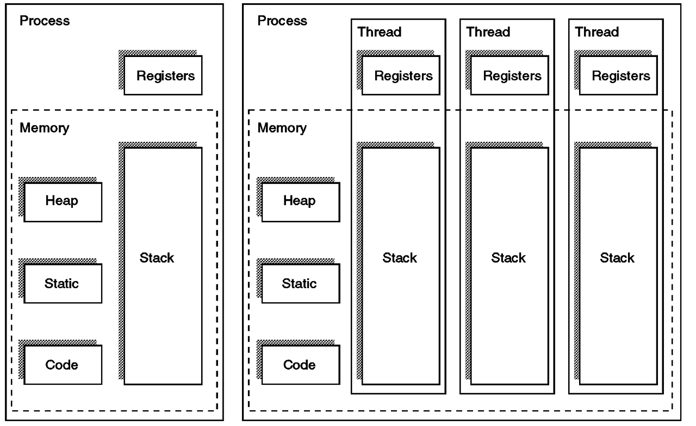

> 쓰레드란?

-   프로세스 실행 단위 
-   하나의 프로세스는 여러 개의 쓰레드로 구성 되어있다. 
-   하나의 프로세스를 구성하는 쓰레드들은 **프로세스에 할당된 메모리, 자원 등을 공유**한다. 
-   프로세스와 같이 실행, 준비, 대기 등의 실행 상태를 가지며,   
    실행 상태가 변할 때마다 쓰레드 문맥 교환(context switching)을 수행한다. 
-   각 쓰레드는 자신만의 **스택과 레지스터**를 가진다. 
-   한 순간에는 하나의 스레드만 실행이 가능하다. (독립적인 수행 단위)

---

> 쓰레드의 장점

-   쓰레드는 프로세스보다 생성 및 종료 시간, 문맥교환 시간이 짧다.
-   **쓰레드는 프로세스의 메모리, 자원 등을 공유하므로, 커널의 도움 없이 상호간의 통신이 가능하다. **

---

> 쓰레드 동기화 방법의 종류

-   Mutex
-   Semaphore
-   Monitor

> 뮤텍스 (Mutex)

-   쓰레드의 동시 접근을 허용하지 않는다. (상호 배제)
-   임계영역에 들어가기 위해 뮤텍스를 가지고 있어야 한다. 
-   일종의 락을 걸고 푸는 것과 같다.   
    임계영역에 들어간 쓰레드가 뮤텍스를 이용해 임계영역에 다른 쓰레드가 들어오지 못하게 내부에서 락을 건다. 

> 세마포어(Semaphore)

-   뮤텍스와 비슷한 역할을 하지만, 동시 접근 동기화가 아닌 접근 순서 동기화에 관련이 있다. 
-   세마포어는 뮤텍스가 될 수 있지만, 뮤텍스는 세마포어가 될 수 없다. 

> 모니터(monitor)

-   Mutex 와 Condition Variables(Queue) 를 가지고 있는 Synchronization 메커니즘이다. 
-   프레임워크나 라이브러리 자체에서 제공한다. 
-   따라서 가볍고 빠르다. 
-   임계구역에는 하나의 쓰레드만이 들어갈 수 있다. (상호배제)
-   synchronized(), notify(), wait() 등의 키워드를 사용하여 동기화가 가능하다.

---

> 프로세스

-   **프로세서(cpu)에 의해 처리되는 사용자/ 시스템 프로그램**
-   자원을 할당받는 작업의 단위
-   실행 중이거나 실행 가능한 프로그램 
-   PCB를 가진 프로그램 
-   비동기적 행위를 일으키는 주체 
-   실 기억장치에 저장된 프로그램 

> 특징 

-   부모 프로세스와 자원을 공유하지 않는다. 
-   자식 프로세스 생성 시 code 영역을 제외하고, **stack, heap, data 영역이 모두 복사된다. **
-   자식 프로세스 생성 시스템 콜 : fork()
-   프로세스의 자원에 접근하기 위해서는 프로세스 간의 통신 IPC를 사용해야 한다. 

---

> 프로세스 제어 블록 (PCB)

프로세스 상태, 포인터, 고유 식별자, CPU 레지스터 정보, 스케줄링 정보를 포함한다. 

#### **Q. PCB는 왜 필요할까?**

인터럽트가 발생하면 시스템은 인터럽트 처리가 끝난 후에 복구할 시점을 저장해야 한다. 

즉, 프로세스를 중단했다가 재개하는 작업을 위한 것이다. 

> Context Switch

하나의 프로세스에서 다른 프로세스로 CPU가 할당되는 과정에서 발생한다. 

**현재 CPU가 할당된 프로세스 정보를 저장 ->** **새로운 프로세스 정보를 설정 or PCB에 저장된 정보를 복원 ->**

**CPU에 할당하여 실행하는 작업이다. **

---

> 프로세스와 쓰레드 

-   부모 프로세스와의 자원 공유 
    -   프로세스는 부모 프로세스와 자원을 공유하지 않는다. 
    -   스레드는 부모 프로세스와 자원을 공유하고, 자신만의 stack 영역을 사용한다. 
-   운영체제로부터 자원을 할당받는 프로세스 / **프로세스가 할당받은 자원을 이용하는 실행의 단위인 스레드**

> **Q. 멀티 프로세스 대신에 스레드를 쓰는 이유?**

시스템 자원을 효율적으로 관리하기 위해서이다. 

멀티 프로세스로 실행되는 작업을 멀티 스레드로 실행할 경우, 

프로세스를 생성하여 자원을 할당하는 시스템 콜이 줄어들어 자원을 효율적으로 관리할 수 있다. 

또한, 스레드 간 통신 비용이 훨씬 적다. 

하지만, 스레드 간의 자원 공유는 전역 변수를 이용하므로 동기화에 신경을 써야 한다. 

---

## 참고

-   [\[운영체제 이론\] 쓰레드(Thread)](http://arer.tistory.com/80)
    
-   [멀티쓰레드란?](https://m.blog.naver.com/PostView.nhn?blogId=rja1104&logNo=220551216367&proxyReferer=https%3A%2F%2Fwww.google.co.kr%2F)
    
-   [\[운영체제\] 뮤텍스(Mutex) 세마포어(Semaphore) 모니터(Monitor)](http://about-myeong.tistory.com/34)
    
-   [스핀 락(Spin lock), 크리티컬 섹션(Critical section), 세마포어(Semaphore), 뮤텍스(Mutex)](http://brownbears.tistory.com/45)
    
-   [\[OS\]메모리 관점에서 본 쓰레드(thread)](https://mooneegee.blogspot.com/2015/01/os-thread.html)
