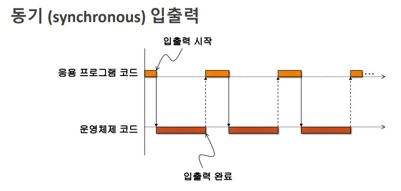
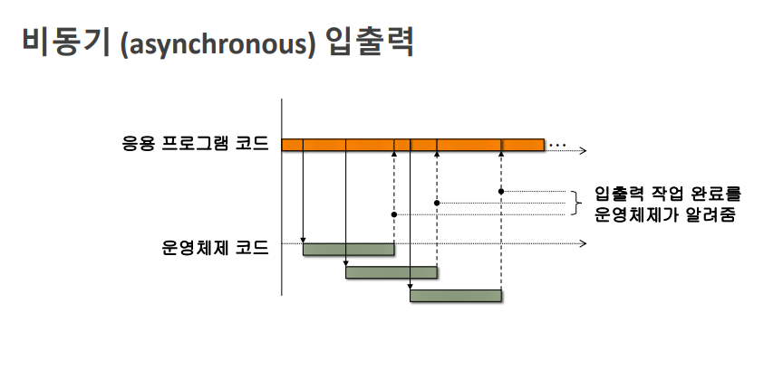

# Blocking & Non-Blocking I/O

## 동기식 입출력

- 순차적으로 실행된다.
- A 라는 함수를 호출했을때, A라는 함수를 호출 했을 때 기대하는 행위를 모두 끝마칠때까지 기다렸다가 리턴되면, 이것은 블로킹 되었다고 한다.

---

## 비동기식 입출력

- A 라는 함수를 호출 했는데, A라는 함수를 호출 했을 때 기대하는 어떤 행위를 요청 하고 바로 리턴되면 이것은 논블럭킹 되었다고 한다.
- 대표적인 기술

  - Ajax(Asynchronous Javascript XML)

    - 전체 프레임은 그대로 있고, 변경되는 동적 데이터만 갱신된다.

            $.ajax({
                    type : 'POST',
                    url : 'users/login',
                    dataType: 'json',
                    contentType : "application/json; charset=utf-8",
                    data : JSON.stringify(user),
                    async : false,
                    success: function(data) {
                        if (data.status == 200) {

                        } else {
                            alert(data.message);
                        }
                    }
                });

    - login 처리가 완료되어 올바르게 처리가 되었다면 success가 실행되어 데이터를 동적으로 변경하거나 다른 페이지로 리다이렉트 되는 등의 처리를 한다.

## 네트워크 상의 동기와 비동기

- 동기는 응답을 받고 나서 다시 송신을 한다. 비동기는 응답 여부와 관계 없이 다시 전송을 할 수 있다.

---

참고

- https://m.post.naver.com/viewer/postView.nhn?volumeNo=10120563&memberNo=773106
- https://wikidocs.net/22372
- https://okky.kr/article/442803
