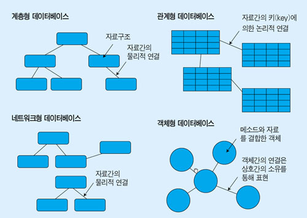
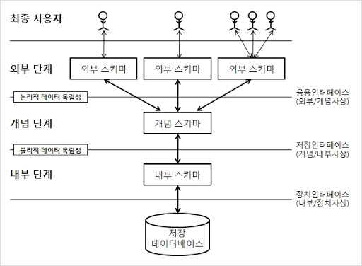
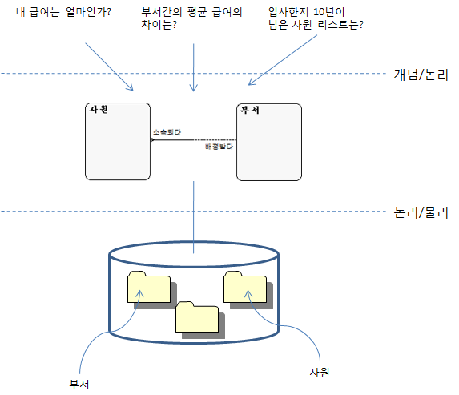
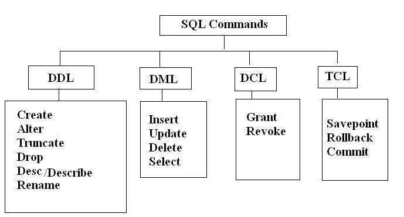

# DBMS (데이터베이스 관리 시스템)

### Databse의 특징

- 여러 사용자에 의해 동시에 사용된다.
- 모든 데이터가 중복을 최소화하면서 통합된다.
- 운영 데이터 뿐 아니라 그 데이터에 대한 설명(스키마, meta data) 까지 포함한다.
- 데이터 구조가 프로그램과 분리되어 저장되므로 데이터 간 독립성을 보장한다.
- 효율적인 접근이 가능하다.

### DBMS의 목적

- 정보와 데이터 사이의 갭을 줄이는 것

## File System

- 파일 시스템은 순차적인 레코드로 구성되어있다.
- 그렇기 때문에 데이터에 대한 응용 프로그램의 의존도가 높다.
- 장점
  - 비용 지출 없이 사용할 수 있다.
  - 속도가 빠르다.
- 단점
  - 데이터 중복 제거 불가
  - 다수 사용자들을 위한 동시성 제어가 제공되지 않는다.
  - query 문 사용 불가
  - 회복 기능이 없다.
  - 프로그램과 데이터 간의 독립성이 없어 유지보수 비용이 크다.
  - 무결성 유지하기 어렵다.

## Database Management System

- 장점
  - 중복성 감소
  - 프로그램과 데이터간의 의존성을 낮출 수 있다.
  - 개발과 유지보수의 비용이 감소한다
  - 표준화 용이
  - 무결성 향상
  - 회복 기능 사용 가능
  - 공유 및 동시 접근 가능
  - 다양한 도구를 사용할 수 있다. (트리거, 트랜잭션, 뷰, 인덱스...)
- 단점
  - 추가적인 비용이 필요하다.
  - 다수의 사용자가 접근하기 때문에 보안 침해 발생 가능성이 있다.

### DBMS의 종류

- 계층 DBMS
  - 각 레코드가 하나의 부모레코드와 많은 자식레코드로 이루어진다.
  - 트리 모양으로 구성된다.
  - 1:N 대응 관계만 존재한다.
  - 상위 레코드 삭제 시 연쇄 삭제가 일어난다.
  - 장점
    - 빠른 속도와 높은 효율성
  - 단점
    - 관계를 명시적으로 정의해야 하고,
    - 접근 방법을 응용 프로그램에 정의해야 한다.
    - 레코드 구조와 응용 프로그램의 수정이 어려워 데이터 독립성이 제한된다.
- 네트워크 DBMS
  - 계층형의 단점을 보완한 데이터 모델
  - N:M 구조를 허용한다.
  - 하위에서 상위로의 이동이 자유롭다.
  - 상하위 관계를 owner-member라고 통칭한다.
  - 각 레코드가 여러 부모와 자식 레코드를 가질 수 있다.
  - 일반화된 그래프 구조를 이룬다.
  - 네트워크 모델을 사용하는 데이터 시스템
    - 통합 데이터 저장 (IDS)
    - RDM 임베디드
- 관계형 DBMS
  - 현재 가장 많이 쓰이는 데이터 모델이다.
  - Table들로 구성되고, 표의 칼럼 간 관계가 정의되는 구조의 Database이다.
  - 오라클, MySQL등이 이 모델을 사용한다.
  - DBMS간의 변환이 용이하다.
  - 단점이 있다면, 구현이 쉽지 않다.
  - 많은 연산에 대해 계층형이나 네트워크형보다는 효율성이 떨어진다.

## Data Isolation

- 필요성
  - 유지보수 비용 절감
  - 데이터 복잡도 감소
  - 데이터 중복성 감소
  - 요구사항 대응

### 데이터베이스 3단계 구조

- 외부 스키마 : 여러 개의 사용자 관점 스키마
- 개념 스키마 : 조직 전체의 DB를 기술. DB에 저장되는 데이터와 그들간의 관계를 표현하는 스키마
- 내부 스키마 : 물리적 장치에서 데이터가 실제로 저장되는 방법을 표현하는 스키마

---

- 논리적 독립성
  - 개념 스키마가 변경되어도 외부 스키마는 영향을 미치지 않도록 지원하는 것.
  - 논리적 구조가 변경되어도 응용 프로그램에 영향을 미치지 않는다.
- 물리적 독립성
  - 내부 스키마가 변경되어도 외부/ 개념 스키마는 영향을 받지 않도록 한다.
  - 저장장치의 변경은 응용 프로그램과 개념 스키마에 영향을 주지 않는다.

---

## 데이터베이스 언어

- 데이터 정의어 (DDL)
  - 데이터베이스 스키마를 정의한다.
  - DDL은 스키마에 대한 정의를 시스템 카탈로그나 데이터 사전에 저장한다.
  - SCHEMA, DOMAIN, TABLE, VIEW, INDEX를 정의하거나 변경 또는 삭제할 때 사용하는 언어
- 데이터 조작어 (DML)
  - 데이터베이스 내에 원하는 데이터를 CRUD 한다.
  - 데이터베이스 사용자와 데이터베이스 관리 시스템 간의 인터페이스 제공
- 데이터 제어어 (DCL)
  - 데이터의 보안, 무결성, 데이터 회복, 병행 수행 제어 등을 정의하는 데 사용하는 언어
  - 권한을 부여하거나 수거한다.

## SQL View

- 뷰를 사용하는 이유

  - SQL문을 재사용하기 위해서
  - 복잡한 SQL 작업을 단순화하기 위해
  - 완전한 테이블이 아니라 일부분만을 노출하기 위해서
  - 데이터 보안성
  - 데이터 형식을 변경하기 위해서 (뷰는 본래 테이블과는 다른 형식으로 데이터를 가져올 수 있다.)

- 뷰 규칙과 제한

  - 고유한 이름을 가진다.
  - 생성할 수 있는 뷰의 수에는 제한이 있다.
  - 뷰를 생성하기 위해서는 권한을 가져야 한다.
  - 뷰는 뷰를 포함할 수 있다.
  - 뷰는 인덱스의 트리거 또는 기본값으로 사용될 수 있다.
  - 일부 DBMS는 삽입 또는 업데이트로 뷰의 일부분이었던 행이 이탈하면서, 삽입이나 업데이트를 허용하지 않는 뷰를 생성할 수 있다.

- 뷰 생성하기

        CREATE VIEW ProductCustomers AS SELECT cust_name, cust_contact, prod_id FROM Customers, Orders, OrderItems WHERE Customers.cust_id = Orders.cust_id AND OrderItems.order_num = Orders.order_num;

- 뷰 조회하기

        SELECT * FROM ProductCustomers;

---

참고

- https://github.com/dh00023/TIL/blob/f2e19a895b75a8d4b5b6572fecac7f07ba5c6489/database/book/chapter1.md

- https://raisonde.tistory.com/entry/%EC%8B%9C%ED%97%98%EB%8C%80%EB%B9%84-%EB%8D%B0%EC%9D%B4%ED%84%B0%EB%B2%A0%EC%9D%B4%EC%8A%A4-%EB%AA%A8%EB%8D%B8%EC%9D%98-%EC%A2%85%EB%A5%98%EC%99%80-%ED%8A%B9%EC%A7%95%EC%9D%84-%EC%89%BD%EA%B2%8C-%EC%9D%B4%ED%95%B4%ED%95%98%EC%9E%90

- https://github.com/kdsr2z0/kdsr2z0.github.io/blob/287fb4534f1f59d9dcd7e6e8434b27034a395fc9/tmp/1%EC%9E%A5%20%EB%8D%B0%EC%9D%B4%ED%84%B0%EB%AA%A8%EB%8D%B8%EB%A7%81%EC%9D%98%EC%9D%B4%ED%95%B4.txt

- http://www.databaser.net/moniwiki/wiki.php/3%EB%8B%A8%EA%B3%84%EC%8A%A4%ED%82%A4%EB%A7%88%EA%B5%AC%EC%A1%B0
