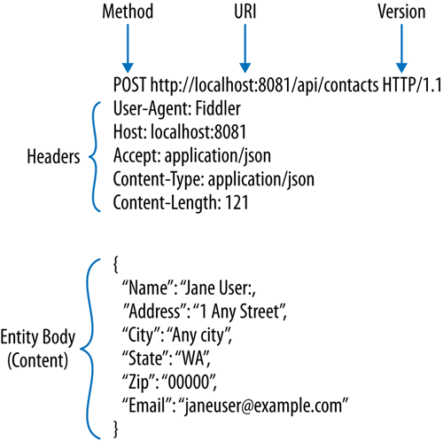

# HTTP
## HTTP?
- Hypertext transfer protocol
- www(world wide web) 상에서 정보를 주고받을 수 있는 통신 규약이다. 
- TCP와 UDP를 사용하며, 80번 포트를 사용한다. 
- HTTP 를 통해 전달되는 자료는 http:로 시작되는 URL로 조회할 수 잇따. 

## 주요 특징 
- 비 연결성(connectionless)
    - 클라이언트와 서버가 한 번 연결을 맺은 후, 클라이언트 요청에 대해 서버가 응답을 마치면 연결을 끊는다. 
    - 장점
        - HTTP는 인터넷 사엥서 불특정 다수의 통신 환경을 기반으로 설계되었다. 
        - 만약 서버에서 다수의 클라이언트와 연결을 유지해야한다면, 많은 리소스가 발생하게 된다. 
        - 연결을 유지하기 위한 리소스를 줄이면서 더 많은 연결을 할 수 있다. 
    - 단점
        - 서버는 클라이언트를 기억하고 있지 않으므로, 동일한 클라이언트의 모든 요청에 대해 매번 새로운 연결을 시도/ 해제의 과정을 거쳐야 한다. 
        - 연결 / 해제에 대한 오버헤드가 발생한다. 
- keepAlive
    - 비연결성의 단점을 극복하기 위한 방안으로 오버헤드를 줄이기 위해 keepAlive 속성을 사용할 수 있다. 
    - keepAlive는 지정된 시간동안 서버와 클라이언트 사이에서 패킷 교환이 없는 경우, 상대방의 안부를 묻기 위해 패킷을 주기적으로 보내는 것이다. 
    - 이 때, 패킷의 반응이 없다면 연결을 해제한다. 
- 무상태 (stateless)
    - 무상태란? 
        - 클라이언트를 식별할 수 없는 상태이다. 
        - 예를 들어, 쇼핑몰에 접속 -> 로그인 
        - 상품 클릭 -> 상세화면 이동 -> 로그인 
        - 장바구니 담기 -> 로그인 
    - 매번 새로운 인증을 해야하는 번거로움이 있다. 
    - 상태를 기억하는 방법 
        - 쿠키 
            - 클라이언트가 기억하는 방법 
            - 브라우저 단에서 쿠키라는 것을 저장하여 서버가 클라이언트를 식별한다. 
        - 세션
            - 쿠키는 브라우저 상에 사용자의 정보가 저장되기 때문에 위변조 가능성이 높다. 
            - 세션은 서버단에서 사용자의 정보를 저장한다. 
            - 서버의 메모리를 차지하게 되므로, 동시 접속자의 수가 많은 서비스인 경우에는 서버 과부하의 원인이 된다. 
        - 토큰을 이용 : OAuth, JWT
            - 쿠키와 세션의 문제점을 보완하기 위해 도입됐다. 
            - 보호할 데이터를 토큰으로 치환하여 원본 데이터 대신 토큰을 이용하는 기술이다. 
            - 중간에 공격자로부터 토큰이 탈취당하더라도 데이터에 대한 정보를 알 수 없으므로 보안성이 높다. 

## 응답 메시지 
### 클라이언트 요청 
    
### 서버 응답 
    Date: Mon, 23 May 2005 22:38:34 GMT
    Content-Type: text/html; charset=UTF-8
    Content-Encoding: UTF-8
    Content-Length: 138
    Last-Modified: Wed, 08 Jan 2003 23:11:55 GMT
    Server: Apache/1.3.3.7 (Unix) (Red-Hat/Linux)
    ETag: "3f80f-1b6-3e1cb03b"
    Accept-Ranges: bytes
    Connection: close

    <html>
    <head>
    <title>An Example Page</title>
    </head>
    <body>
    Hello World, this is a very simple HTML document.
    </body>
    </html>
    
- 응답 상태코드 
    - 클라이언트가 서버에 요청을 하며 서버는 요청에 대한 처리 상태를 숫자로 반환하는데 이를 응답코드라고 한다. 
    - HTTP 응답에는 상태코드를 헤더에 추가한다. 
        - 100-109 : 메시지 정보 
        - 200-206 : 요청 성공 
        - 300-305 : 리다이렉션
        - 400-415 : 클라이언트 에러 
        - 500-505 : 서버에러 
- HTTP method
    - 클라이언트가 서버로 요청을 할 때, 어떤 목적을 갖는 행위인지 HTTP 메서드에서 명시한다. 
    - GET : 리소스 요청 
    - HEAD : 리소스를 가져올 필요 없이 헤더의 정보만 요청 
    - PUT : 이미 URI가 존재한다면 변경을 요청하고, 존재하지 않는다면 새로 만든다. 
    - DELETE : 요청 URI 리소스 삭제 
    - POST : 서버에 입력데이터를 전송 
    - TRACE : 클라이언트와 목적지 서버에 있는 모든 HTTP 애플리케이션 요청/응답 연쇄를 따라가면서 자신이 보낸 메시지의 이상 유무를 파악한다. 
    
---
출처
https://www.youtube.com/watch?v=RP_f5dMoHFc
http://www.hardcopyworld.com/ngine/aduino/index.php/archives/3287
