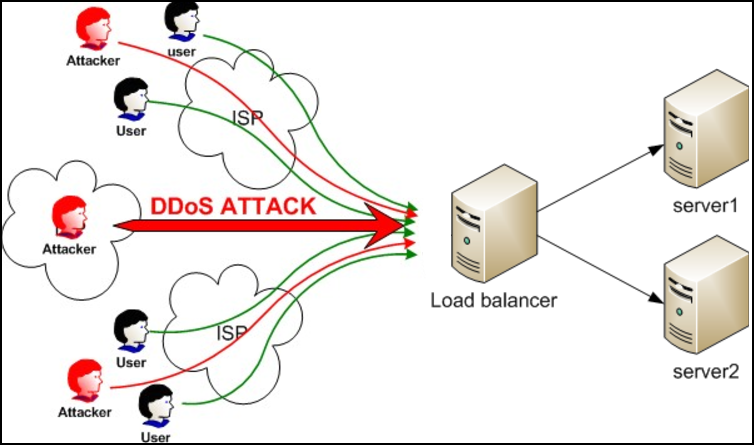

# Load Balancing (로드 밸런싱, 부하 분산)

## 부하 분산

- 둘 혹은 셋이상의 중앙처리장치 혹은 저장장치와 같은 컴퓨터 자원들에게 작업을 나누는 것을 의미한다.
- 과부하 처리 및 트래픽 증가, 접속 속도 저하 등 단일 서버로 인해 발생할 수 있는 문제점을 해결할 수 있다.
- 부하 분산은 트래픽이 많은 웹 사이트, IRC 네트워크, FTP 사이트, NNTP 서버 그리고 DNS서버에 적용이 되고 있다.
- 웹서버를 이중화하고 L4 스위치로 부하를 분산시키는 것

## 과도한 트래픽

- 가장 대표적인 예는 DDos 공격이다.

- 다수의 사용자의 요청이 한 서버에 과도하게 집중되게 된다면 웹 서버의 부하가 증가하게 된다.
- 이때, 로드 밸런싱을 한다면 부하를 분산시켜 서버가 일시 중단되는 상황을 방지할 수 있다.

## 로드밸런싱의 방법

- DNS 서버를 이용한 라운드로빈
- 네트워크 로드밸런싱

  - L2 (data link)
    - Mac Address Load Balancing
    - 브릿지, 허브
    - 장점
      - 구조가 간단하고 신뢰성이 높다.
      - 가격이 저렴하고 성능이 좋다.
    - 단점
      - Boardcast 패킷으로 인한 성능저하 발생한다.
      - 라우터 등 상위 레이어 프로토콜 기반의 스위칭이 불가능하다.
  - L3(network)

    - IP Address Load Balancing
    - L2+routing
    - Router, ICMP 프로토콜, IP
    - 장점
      - broadcast 트래픽으로 성능 저하를 방지할 수 있고
      - 트래픽 체크가 가능하다.
    - 단점
      - 특정 프로토콜을 사용해야만 한다.

  - L4(trasport)
    - IP + Port Load Balancing
    - TCP, UDP
    - 장점
      - 포트 기반의 스위칭을 지원한다.
    - 주로 라운드로빈 방식 사용
  - L7(Application)
    - Application Load Balancing
    - IP + Port + packet
    - Http, FTP, SMTP

## 로드밸런싱 주요 기술

- NAT(Network Address Translation)
  - 사설 IP주소를 공인 IP주소로 변경
- Tunneling
  - 인터넷상에서 눈에 보이지 않는 통로를 만들어 통신할 수 있게 하는 개념
  - 데이터를 캡슐화해서 연결된 상호 간에만 캡슐화된 패킷을 구별해 캡슐화를 해제

## 로드밸런서 알고리즘 종류

- 라운드로빈
  - 요청을 순서대로 각 서버에 균등하게 분배하는 방식
  - 서버 커넥션 수나 응답시간에 상관없이 모든 서버를 동일하게 처리
  - 다른 알고리즘에 비해서 가장 빠르다
- Least connection (최소 접속 방식)
  - 서버에 연결되어 있는 Connection 개수만 갖고 단순비교하여 가장 적은곳에 연결
- Weighted Least Connections(가중치 최소접속방식)
  - 서버에 부여된 Weight 값을 기반으로 Connection 수의 개수와 같이 고려하여 할당
- Fastest Response Time(응답시간방식)
  - 가장 빨리 응답하는 서버에 이용자 요구를 연결하는 방법. 응답시간은 각 서버가 패킷 형태의 요구를 송수신하는데 걸리는 시간을 측정한 것이다.
