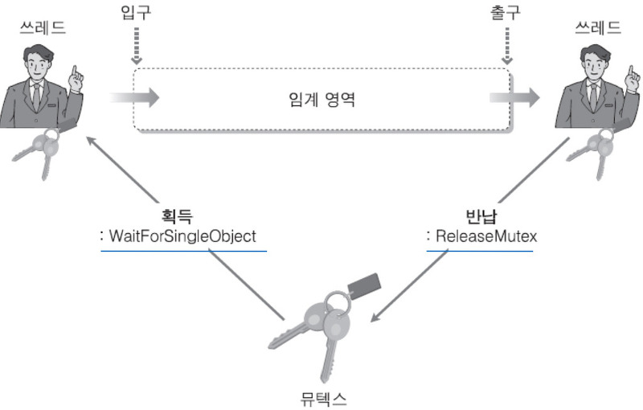
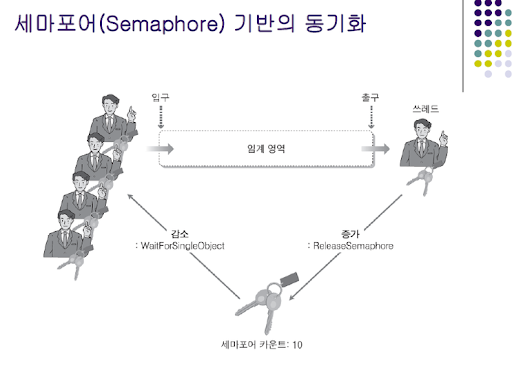

> 멀티 스레드

-   하나의 프로세스 내에서 여러 개의 스레드를 이용하여 동시에 처리한다. (병렬 처리)
-   다수의 스레드는 하나의 데이터 자원을 공유하기 때문에 메모리 효율성이 높다. 

> Q. 멀티 프로세스 대신에 멀티 스레드를 사용하는 이유?

-   자원의 효율성 증대
    -   프로세스 간의 문맥 교환은 CPU 레지스터 교체, RAM과 CPU 사이의 캐시 메모리 초기화까지 진행된다. 
    -   따라서 자원을 공유하는 멀티 스레드는 처리 비용의 감소와 응답 시간이 단축된다. 
    -   프로세스를 생성하여 자원을 할당하는 시스템 콜이 줄어든다. (오버헤드 감소)

---

> 단점

-   프로세스 외부에서 스레드 제어가 어렵다. 
-   동기화 문제 
-   하나의 스레드에서 문제가 발생하면 프로세스 전체에 영향을 준다. 

---

> 스레드 풀 (Thread Pool)

프로세스를 시작할 때 일정한 수의 스레드들을 미리 pool 로 만들어 두는 것이다. 

스레드 풀 안에 있는 스레드 들은 할당된 서비스가 없으면 가만히 있다가, 

서비스가 요청되면 처리하고 다시 풀로 돌아간다. 

만약, 스레드 풀에 남아있는 스레드가 바닥나면 서버는 가용 스레드가 생길 때까지 기다려야 한다. 

-   장점   
    새 스레드를 생성하는 일에는 성능 오버헤드가 있는데   
    스레드 풀을 이용하여 기존 스레드를 활용하기 때문에 빠르다. 

---

> 스레드 제어 블록 TCB

-   스레드 상태
-   스택 포인터
-   PC
-   스레드의 레지스터 값
-   스레드가 있는 프로세스의 PCB를 가르키는 포인터 

---

> 동기화

-   커널에서 제공하는 동기화 기능 : 뮤텍스, 세마포어 
-   그 외 : 모니터, 크리티컬 섹션, 인터락 함수 기반 동기화

> 동기화 기법

## 임계 구역( Critical Section )

둘 이상의 스레드가 동시에 접근해서는 안되는 공유 자원 코드 영역

**동시에 Read/Write 를 하면 동기화 문제가 생기므로 **

**하나의 프로세스 / 스레드만 수행하도록 Lock을 걸고 해제하며 컨트롤한다. **

임계구역은 선점할 수 없다.

임계 구역 내의 작업은 신속하게 이루어져야 한다. 

**l임계 구역 문제 해결하기 위한 조건**

<table style="border-collapse: collapse; width: 63.3957%; height: 242px;" border="1" data-ke-style="style4"><tbody><tr><td><b>상호 배제&nbsp;( Mutual Exclusion )</b></td><td>
한 프로세스가 임계구역에 들어가 있으면&nbsp;다른 프로세스 들어갈 수 없다.
</td></tr><tr><td><b>진행 ( Progress )&nbsp;</b></td><td>
임계구역에 들어간 프로세스 없다면&nbsp;어느 프로세스가 들어갈 지 적절히 선택
</td></tr><tr><td><b>한정 대기 ( Bounded Waiting )</b></td><td>기아 방지를 위해 한 번 들어갔다 나온 프로세스는 다음에 들어갈 때 제한을 준다.</td></tr></tbody></table>

> ## Lock

자원을 사용하는 동안 들어오지 못하도록 잠구는 것

하나의 자원에 여러 스레드가 동시에 접근하는 것을 조율해준다.

## 스핀락( Spin Lock ) :계속 돌면서 확인

-   다른 스레드가 락을 소유하고 있다면 그 락이 반환될 때까지 확인하며 기다렸다가   
    사용가능하면 바로 처리한다. (busy waiting) 
-   장점
    -   락이 해제될 때 스레드 문맥 교환이 없어 오버헤드 없이 임계구역에 접근이 가능하다. 
-   단점
    -   어떤 스레드가 락을 오래 소유한다면 CPU 시간을 낭비하게 된다.
    -   따라서 임계 영역이 아주 작거나, 빠른 처리가 가능할 때 유용하다. 

---

## 상호 배제,뮤텍스(Mutually Exclusive) :화장실이 하나 뿐인 식당,열쇠1개

-   여러 프로세스/ 스레드가 공유된 자원에 접근하는 것을 막는다. 
-   임계 구역 내에서 인터럽트, 교착상태, 무한 반복이 발생하지 않도록 해야 한다. 
-   키가 1개인 세마포어 
-   소프트웨어적 구현방법  
    -   2개 프로세스 : 데커 알고리즘, 피터슨 알고리즘
    -   그 이상 : 램포트의 빵집 알고리즘 

---
## 세마포어(Semaphore) :화장실이 여러 개 있는 레스토랑,열쇠\=칸 개수 만큼

-   현재 공유자원에 접근할 수 있는 프로세스/스레드 수를 나타내는 값을 두어 상호배제한다.
-   Lock - 특정 수만큼 카운트를 더한다. 
-   UnLock - 특정 수만큼 카운트를 뺀다. 
-   동기화 대상이 여러 개일 때 사용 

### 세마포어 종류

1) 카운팅 세마포어 

P, V라는2개의 연산에 의해서 동기화 유지

S는P와V연산으로만 접근 가능한 세마포어 변수로 공유 자원의 개수를 나타내며

0과1혹은0과 양의 값을 가질 수 있다.

- P연산: 자원의 개수(S = S-1)를 감소시켜 점유되었음을 알림(Wait)

- V연산: 자원의 개수(S = S+1)를 증가시켜 자원이 반납되었음을 알림(Signal),0이 되면 모두 사용중임을 나타냄

    - P(s) = wait(s) { while(s<=0) s--; };

    - V(s) = signal(s){ s++;};

2) 이진 세마포어

세마포어 값으로0또는1을 가진다.

계수 세마포어보다 간단히 구현할 수 있으며,

**Test and Set**등 하드웨어가 지원하는 기능을 이용하여 구현하기도 한다.

또한,이진 세마포어를 이용하여 계수 세마포어를 구현할 수도 있다.

---
## 모니터

-   동기화를 구현하기 위한 프로그램 기법 
-   모니터 내의 공유 자원을 이용하려면 프로세스는 반드시 모니터 진입부를 호출해야 한다.
-   외부의 프로시저는 접근할 수 없으며 
-   모니터의 경계에서 상호배제가 시행되어, 한 순간에 하나의 프로세스만 진입하여 자원을 사용한다. 

---

출처
